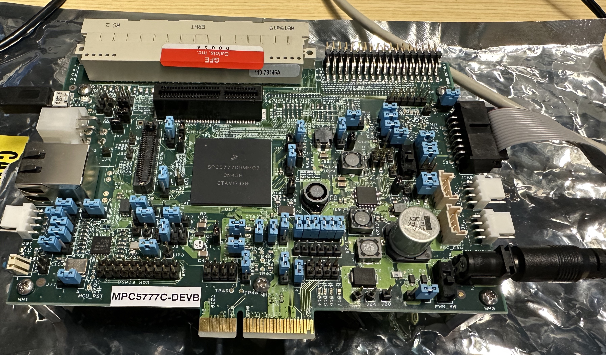
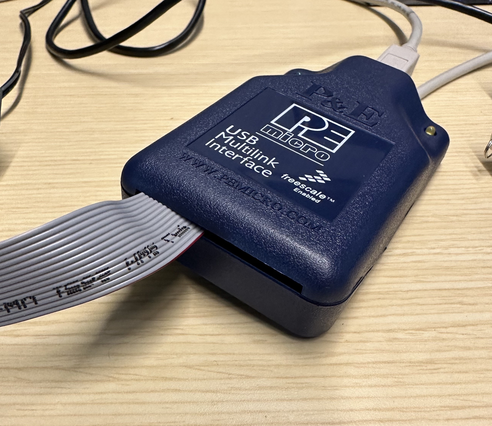
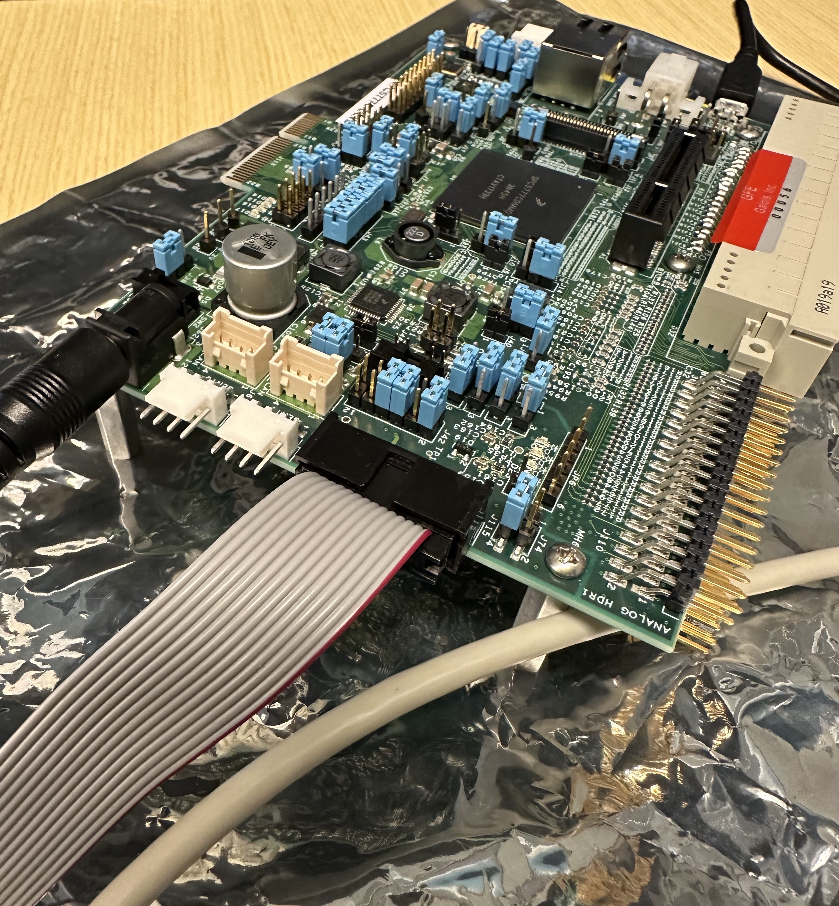
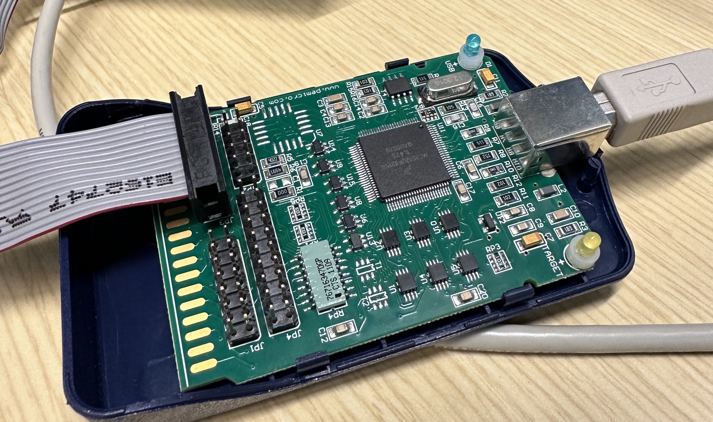

Introduction
============

This repository contains the source code and build system for the
MCTrace binary instrumentation tool. The MCTrace tool enables users
to modify binaries, inserting instrumentation into them in order to
collect fine-grained tracing information. For information on the
MCTrace tool's design and usage, please see `MCTRACE.md`. This document
covers instructions for building MCTrace from source for development or
releases.

Building MCTrace
================

MCTrace can be built for one of two purposes: either for local
development in a Haskell build environment, or for release as a Docker
image. Instructions for each method are detailed below.

Development Build Instructions
------------------------------

The development environment setup and build processes are automated.
The build process requires Ubuntu 20.04. To perform a one-time setup of
the development environment including the installation of LLVM, cross
compilers, and other required tools, run the development setup script:

```
./dev_setup.sh
```

Once the development environment is set up and the required tools are
installed, MCTrace can be built with the build script:

```
./build.sh
```

After the build has completed, various cross compilers and other tools
can be brought into the `PATH` for easier access with:

```
. env.sh
```

To build the example test programs for `x86_64` and instrument them
using various testing probes, run:

```
make -C mctrace/tests/full
```

To do the same for PowerPC, run:

```
make -C mctrace/tests/full ARCH=PPC
```

The `mctrace` tool can be run manually by running:

```
cabal run mctrace <args>
```

For more details on using the `mctrace` tool, see `MCTRACE.md`.

Release Build Instructions
--------------------------

To build the release Docker image, execute the following from the root
of the repository:

```
cd release
./build.sh
```

This will build two docker images: 

- `mctrace.tar.gz`, a self-contained image that contains MCTrace, its
  dependencies, associated tools, and examples. For information on using
  former image, please see `release/README.md`.

- `mctrace-tool.tar.gz`, a minimal image containing just MCTrace and its
  dependencies. A helper script, `release/mctrace` has been provided to
  run the command in a container. Note that paths passed to this script
  should be relative to the root of the repository and paths outside of
  the repository will not accessible.

Status Information
------------------

Some of the work on this project involved attempting to run the
Challenge Problem 10 binary on a real PowerPC microcontroller. We
obtained an NXP development board, the MPC5777C, and a PEMicro USB
Multilink debug adapter for connecting to the board. This work involved
flashing the microcontroller with the Challenge Problem 10 binary, both
original and instrumented versions, under the following conditions:

* NXP S32 Design Studio for Power Architecture, version 2.1
* IBM Thinkpad running Ubuntu 16.04, a supported platform for the NXP
  Design Studio
* PEMicro USB Multilink adapter, model USB QORIVVA Multilink for
  MPC55xx/56xx devices, part # USB-ML-PPCNEXUS
* USB A to USB micro connector for the MPC5777C debug UART

The system installation was done as follows:

* Install Ubuntu 16.04 with a desktop GUI installed.
* Install S32DS 2.1, following the steps in the S32 Design Studio for
  Power Architecture 2.1 Installation Guide.

The flashing procedure was performed by following the steps listed in
the Immunant challenge problem repository and are reproduced below for
posterity. Steps for the booting procedure are also documented below.

In our attempt to flash the MPC5777C with the Challenge Problem 10
binary, our findings and next steps were as follows:

* We were able to use the flashing procedure to load the uninstrumented
  (original) Challenge Problem 10 binary for MPC5777C onto the board.
* Our evidence that an unmodified Challenge Problem 10 binary booted
  somewhat successfully was that we saw the following output on the UART
  console:
```
Setup Complete.
ERROR: Failed to send status update
```
* We then flashed an `mctrace`-instrumented version of the Challenge
  Problem 10 binary. The instrumented version that we found, along with
  its probes, can be found in the `cp10_demo/mpc5777c` directory in this
  repository.
* Our instrumented version failed to boot (as evidenced by no console
  output).
* Even with a platform implementation that does nothing in any of its
  functions (e.g. `platform_send`) and even with probes that do not use
  any global variables (thus not warranting a memory allocation from the
  platform implementation to provide for global variable storage), the
  binary failed to boot. We did not explore this further to determine
  the cause.
* However, one key task left unfinished in our work was to write a
  suitable platform implementation for the MPC5777C. To date, we had
  used a PowerPC platform implementation that was only suitable for
  running in Linux userspace environments. To get a working platform
  implementation on the MPC5777C, an exfiltration mechanism must be
  implemented, such as a CAN bus send operation or a UART write. A next
  step is to obtain either of those and integrate their source directly
  into the compilation process of the MPC5777C platform implementation.

MPC5777C and USB Multilink Setup
--------------------------------

This section details how to connect the PEMicro adapter to the MPC5777C,
since there is no suitable documentation on how to get this right.

This image shows the board at a glance, with the power connector and
power switch visible in the lower right corner of the board. The USB
UART is connected at the far left part of the board and the PEMicro
debugging adapter's ribbon cable is connected on the right with the red
stripe (Pin 1) positioned furthest from the power connector.



This image shows the PEMicro adapter with its ribbon cable coming from
its enclosure.



This image shows how the PEMicro adapter's ribbon cable connects to the
MPC5777C, with the red stripe position indicating Pin 1.



This image shows how the ribbon cable is connected to the internal
header in the PEMicro adapter. Of all of the headers available, two fit
the provided 14-pin cable. The correct header is the lower-left header,
pictured here, and the Pin 1 orientation is the lower-right pin of the
header if looking at the board from above.



Immunant Flashing Procedure
---------------------------

Source: [Immunant AMP Challenge Problem repository](https://github.com/immunant/AMP_Challenge_Problems/tree/master/Challenge_10/mpc5777c_dev_c10)

* Right click in the Project Explorer tab within S32DS.
* Click "Import".
* In the Import window, navigate to "S32 Design Studio" > "Executable File Importer".
* Click "Next".
* Click "Browse" and navigate to your binary of interest.
* Under "Please specify hardware parameter ...",
* navigate to "MPC5777C" > "MPC5777C" > "Z7_0" for the core selection.
* Click "Next".
* Specify a project name and rename the launch configuration if desired.
* Click "Finish".

With the project created, you can then navigate in project explorer
to the project. Navigate to "{Project Name}" > "Binaries" > "{Binary
Name}". Right click on "{Binary Name}" and then click "{Flash from
file}".

If there are no launch configurations, click on the "New launch
configuration" button, which will create a new configuration based
on the binary's name. Otherwise, you can use one of the flash
configurations if there is one already populated for the MPC5777C. This
may happen if you have created other projects.

Select the desired configuration (likely just created), and click on the
"PEMicro Debugger" tab. For "Interface" select the "USB Multilink..."
option. For port, select the port that the Multilink is connected to.
Likely some COMX type variant. For "Device Name", be sure "MPC5777C"
is selected and "Z7_0" for "Core". Default options should work for the
rest. Click "Flash".

A similar workflow should be possible by selecting the project,
right-clicking "Debug as" or "Runs as" after the above steps and
selecting "S32DS C/C++ Application". This, however, was not tested as of
writing this document.

Booting the MPC5777C
--------------------

* Plug in the power adapter.
* Connect a USB micro cable to the debugging UART USB connector on the
  left side of the board (the opposite end from the power connector).
* On the Linux host to which the USB UART is connected, run `sudo
  minicom -D /dev/ttyUSB0` to connect `minicom` to the UART.
* Flip the power switch (the switch immediately next to the power
  connector).

Acknowledgements
================

This material is based upon work supported by the United States Air
Force AFRL/SBRK under Contract No. FA8649-21-P-0293, and by the Defense
Advanced Research Projects Agency (DARPA) and Naval Information Warfare
Center Pacific (NIWC Pacific) under Contract Numbern N66001-20-C-4027 and 140D0423C0063.
Any opinions, findings and conclusions or recommendations expressed in
this material are those of the author(s) and do not necessarily reflect
the views of the DARPA, NIWC Pacific, or its Contracting Agent, the U.S. Department of the Interior, Interior Business Center, Acquisition Services Directorate, Division III..

SBIR DATA RIGHTS  
Contract No. 140D0423C0063  
Contractor Name: Galois, Inc.  
Contractor Address: 421 SW Sixth Ave., Suite 300, Portland, OR 97204  
Expiration of SBIR Data Protection Period: 06/07/2042  
The Government's rights to use, modify, reproduce, release, perform, display, or disclose technical data or computer software marked with this legend are restricted during the period shown as provided in paragraph (b)(5) of the Rights in Noncommercial Technical Data and Computer Software-Small Business Innovation Research (SBIR) Program clause contained in the above identified contract. After the expiration date shown above, the Government has perpetual government purpose rights as provided in paragraph (b)(5) of that clause. Any reproduction of technical data, computer software, or portions thereof marked with this legend must also reproduce the markings.

(c) 2022-2024 Galois, Inc.
